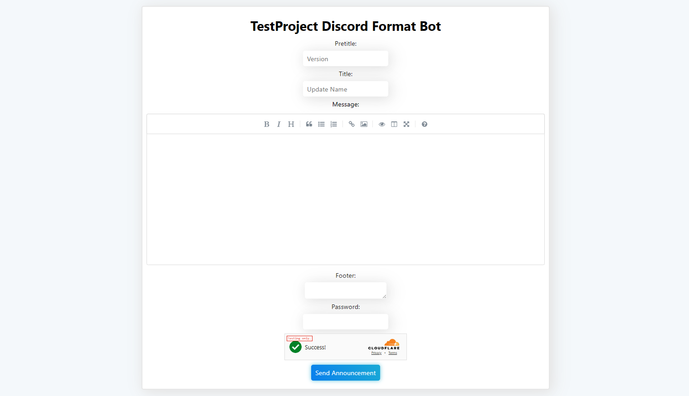

# 📒 Discord Message Formatter

This is a simple Discord message formatter that uses embeds to format messages in a more appealing way. It uses the Discord Webhook API to send messages and is easily customizable.

## ❓ How to Use

Clone the repo, create a Cloudflare account, and run `bun i` to install deps. Rename the `wrangler.toml.example` file to `wrangler.toml` and modify it to fit your needs. Then, run `bun run deploy` to deploy. Then, log in with your Cloudflare account.

**TURNSTILE:** You can add a Turnstile form for bot spam and brute force protection. Go to the CF Dashboard, add a site, and copy the keys into the `wrangler.toml` file.

*Note:* you can replace `bun` with `npm` to use on npm

## 🧑‍💻 Local Development

Run `bun run dev` to start the Wrangler dev server. To pass Turnstile, paste in these developer keys:

```
TURNSTILE_SITEKEY = "1x00000000000000000000AA"
TURNSTILE_SECRET = "1x0000000000000000000000000000000AA"
```

## 🌄 What it looks like


